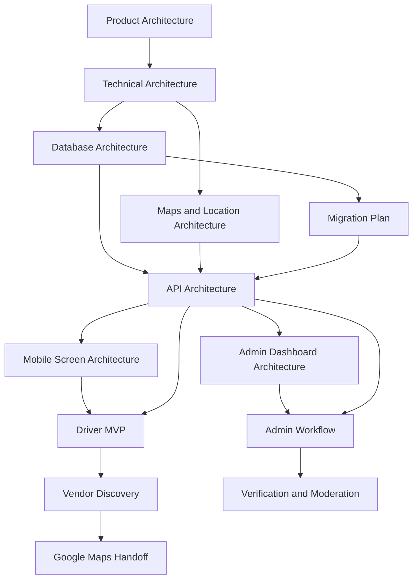

# Highway Setu Audit and V1 Development Plan

## Audit Scope

This audit covers the available agents, skills, context skills, and MCP server surfaces visible in the workspace, plus a readiness assessment for the systems required before implementation begins.

## 1) Connected MCPs

### Declared in Workspace Docs

1. Filesystem MCP
2. Firebase MCP
3. Google Maps MCP

### Not Declared as Connected in Workspace Docs

1. PostgreSQL MCP
2. GitHub MCP

### Verification Summary

- Filesystem is reachable through workspace file tools and directory reads.
- Firebase MCP has a local server package and entrypoint, but live runtime validation is blocked until Firebase credentials are available.
- Google Maps MCP has a local server package and entrypoint, but live runtime validation is blocked until a Google Maps API key is available.
- PostgreSQL has no MCP server package in the workspace and no direct verification path exposed through the current toolset.
- GitHub is reachable through the GitHub tools available in this environment, but there is no separate GitHub MCP server declared in the workspace.

## 2) MCP Connection Checks

### Filesystem

- Status: Working
- Evidence: workspace directory listing and file reads succeed.

### GitHub

- Status: Working
- Evidence: GitHub text search returns results from a public repository.

### PostgreSQL

- Status: Missing
- Evidence: no PostgreSQL MCP server directory is present in `mcp-servers/`, and no direct PostgreSQL MCP tool is available in this environment.

### Firebase

- Status: Partially Ready
- Evidence: `mcp-servers/firebase-mcp/` exists with `index.js` and package dependencies.
- Blocker: no credentials were configured, so live connection could not be verified.

### Google Maps

- Status: Partially Ready
- Evidence: `mcp-servers/google-maps-mcp/` exists with `index.js` and package dependencies.
- Blocker: no API key was configured, so live connection could not be verified.

## 3) Available Agents

1. Product Architect
2. Backend Architect
3. Mobile App Architect
4. Admin Dashboard Architect
5. GIS and Maps Specialist

## 4) Available Skills

1. agent-workflow
2. api-architect
3. database-architect
4. highway-setu-context
5. maps-and-location-expert
6. mobile-architect
7. supabase
8. supabase-postgres-best-practices

## 5) Available Context Skills

1. highway-setu-context
2. agent-workflow
3. api-architect
4. database-architect
5. maps-and-location-expert
6. mobile-architect
7. supabase
8. supabase-postgres-best-practices

## 6) Readiness Report

### Working Components

- Workspace filesystem access
- GitHub search access
- Project context skill for Highway Setu
- Agent workflow guidance
- Agent directories for product, backend, mobile, admin, and GIS roles
- Local Firebase MCP package skeleton
- Local Google Maps MCP package skeleton

### Missing Components

- PostgreSQL MCP connection
- Verified Firebase credentials
- Verified Google Maps API key
- Confirmed PostgreSQL connection path
- Confirmed admin/mobile/backend implementation scaffolding
- Confirmed monorepo-level folder structure for apps and shared packages

### Misconfigured Components

- MCP documentation declares Filesystem, Firebase, and Google Maps, but only Filesystem is actually verifiable from the current tool environment.
- PostgreSQL is a required platform dependency for Highway Setu but is not exposed through any connected MCP in this workspace.
- The project context and agent prompts mention TypeScript and clean architecture, but the backend package currently uses JavaScript and a flat entrypoint.

### Recommended Fixes

- Add or expose a PostgreSQL MCP connection before schema design work starts.
- Configure Firebase service account credentials before OTP and FCM work.
- Configure a Google Maps API key before any location or vendor discovery validation.
- Align the backend package with TypeScript and modular clean architecture before feature implementation.
- Establish a monorepo folder structure so mobile, backend, admin, and shared contracts are separated cleanly.

## 7) V1 Development Plan

### Phase 0: Architecture Approval

1. Approve product architecture.
2. Approve technical architecture.
3. Approve database architecture.
4. Approve API architecture.
5. Approve mobile screen architecture.
6. Approve admin dashboard architecture.
7. Approve dependency graph.

### Phase 1: Platform Foundations

1. Establish monorepo folder structure.
2. Add PostgreSQL connectivity and migrations.
3. Configure Firebase OTP and FCM.
4. Configure Google Maps API access.
5. Define shared types, validation, and localization contracts.

### Phase 2: Identity and Core Data

1. Implement user identity model.
2. Implement role-based session model.
3. Implement driver profiles and truck records.
4. Implement vendor profiles and verification metadata.

### Phase 3: Driver MVP

1. OTP login.
2. Language selection.
3. Driver profile.
4. Truck details.
5. Start journey.
6. Live tracking.
7. Nearby vendor discovery.
8. Vendor detail.
9. Google Maps handoff.

### Phase 4: Vendor Onboarding

1. Dhaba registration.
2. Dhaba amenities and menu management.
3. Mechanic registration.
4. Mechanic service management.
5. Vendor availability.
6. Photo/document upload.

### Phase 5: Admin Controls

1. User management.
2. Vendor management.
3. Verification queue.
4. Audit logs.
5. Analytics summary.

### Phase 6: Stabilization

1. Offline handling.
2. Battery-aware location tuning.
3. Localization review.
4. Low-end device testing.
5. Security hardening.
6. Monitoring and alerts.

## 8) Required Architecture Deliverables Before Coding

1. Product Architecture
2. Technical Architecture
3. Database Architecture
4. API Architecture
5. Mobile Screen Architecture
6. Admin Dashboard Architecture

## 9) Dependency Graph

## 10) Build Order Recommendation

1. Approve the architecture set.
2. Fix missing MCP and credential dependencies.
3. Lock the data model.
4. Lock the API contract.
5. Lock the mobile and admin screen inventories.
6. Build the platform foundations.
7. Implement driver MVP.
8. Implement vendor onboarding.
9. Implement admin workflows.
10. Run integration and device-level testing.

## 11) Executive Summary

Highway Setu is not ready for implementation until PostgreSQL access is exposed and Firebase plus Google Maps credentials are configured. The design surface is otherwise well scoped: a single role-based backend, PostGIS-enabled vendor discovery, a minimal mobile-first UI, and a dedicated admin review workflow.