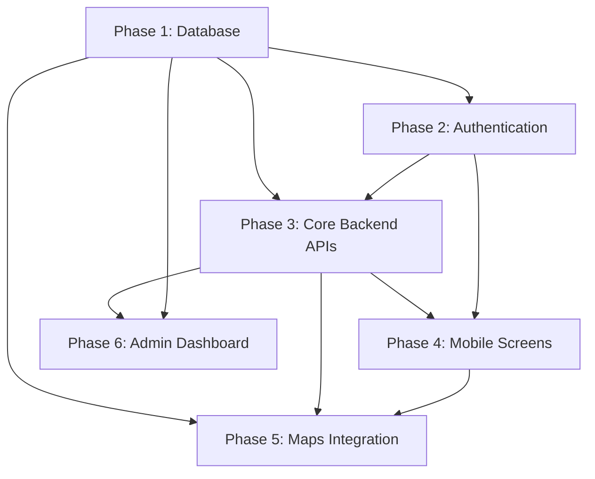

# Highway Setu V1 Implementation Roadmap

This roadmap defines the build order for Highway Setu V1. It is intentionally architecture-first and contains no implementation code.

## Scope Guardrails

- No duplicate systems.
- No dead code.
- No unused tables.
- No unused APIs.
- No unused screens.
- Every database table must support at least one feature.
- Every API must be consumed by at least one screen.
- Every screen must have a business purpose.

## Phase 1: Database

### Tasks

1. Finalize the V1 entity model for users, drivers, vendors, journeys, location history, media metadata, and audit logging.
2. Define PostgreSQL tables, relationships, constraints, and indexes.
3. Enable PostGIS for vendor discovery and distance calculations.
4. Define role, status, vendor type, and verification state conventions.
5. Define data retention expectations for journey history and location pings.
6. Align translation-related fields with the multilingual strategy.

### Dependencies

1. Product architecture must be approved.
2. Technical architecture must be approved.
3. PostgreSQL access must be available.
4. PostgreSQL MCP or equivalent database tooling must be connected.
5. Required entity scope must be frozen so no unused tables are created.

### Required MCPs

1. Filesystem
2. PostgreSQL
3. GitHub for reference search and comparison

### Required Skills

1. database-architect
2. supabase-postgres-best-practices
3. highway-setu-context
4. agent-workflow

### Required Agents

1. Database Architect
2. Product Architect
3. Backend Architect
4. GIS and Maps Specialist

### Deliverables

1. Approved PostgreSQL schema.
2. Table-by-table purpose mapping.
3. Constraint and index plan.
4. Migration sequence.
5. Data retention policy notes.

### Acceptance Criteria

1. Every table is tied to at least one V1 feature.
2. Every foreign key supports a documented workflow.
3. Spatial search requirements are supported by PostGIS.
4. No table exists without a screen or API consumer.
5. The schema supports driver, dhaba, mechanic, and admin workflows without duplication.

## Phase 2: Authentication

### Tasks

1. Define Firebase OTP sign-in flow.
2. Define backend session exchange or JWT issuance flow.
3. Define role assignment and onboarding state handling.
4. Define device token registration for notifications.
5. Define auth error handling for invalid, expired, or duplicate sessions.

### Dependencies

1. Database phase must define the `users` and `device_tokens` model.
2. Firebase credentials must be available.
3. Auth session rules must be approved before endpoint design.
4. Mobile onboarding flow must be agreed so login states map to screens.

### Required MCPs

1. Filesystem
2. Firebase
3. GitHub

### Required Skills

1. api-architect
2. highway-setu-context
3. mobile-architect
4. agent-workflow

### Required Agents

1. Backend Architect
2. Mobile App Architect
3. Product Architect

### Deliverables

1. Authentication flow spec.
2. Token and session model.
3. Auth endpoint contract.
4. OTP error matrix.
5. Onboarding state map.

### Acceptance Criteria

1. A verified phone number results in exactly one active user identity.
2. The auth flow distinguishes driver, dhaba owner, mechanic, and admin roles.
3. Login state transitions map cleanly to mobile screens.
4. No auth endpoint exists without a consuming screen or workflow.

## Phase 3: Core Backend APIs

### Tasks

1. Define driver profile, truck, journey, vendor, and admin API contracts.
2. Define vendor discovery and distance calculation APIs.
3. Define vendor verification, amenity, service, menu, and photo APIs.
4. Define validation rules and standardized error responses.
5. Define audit logging hooks for sensitive changes.
6. Define pagination and filtering conventions.

### Dependencies

1. Database schema must be approved.
2. Authentication and JWT/session rules must be approved.
3. Mobile screen inventory must be approved so every API has a consumer.
4. GIS requirements must be approved for location-based endpoints.

### Required MCPs

1. Filesystem
2. PostgreSQL
3. GitHub
4. Firebase for auth-related verification flows
5. Google Maps for vendor search validation where needed

### Required Skills

1. api-architect
2. database-architect
3. maps-and-location-expert
4. highway-setu-context
5. agent-workflow

### Required Agents

1. Backend Architect
2. GIS and Maps Specialist
3. Product Architect
4. Mobile App Architect

### Deliverables

1. API catalog with request and response contracts.
2. Validation rules.
3. Error handling matrix.
4. Authorization matrix.
5. API-to-screen mapping.

### Acceptance Criteria

1. Every API is consumed by at least one V1 screen.
2. Every API has a defined business purpose.
3. No endpoint duplicates another endpoint’s responsibility.
4. Location APIs return data that supports driver discovery flows.
5. Admin APIs are isolated by role-based authorization.

## Phase 4: Mobile Screens

### Tasks

1. Design driver screens for OTP login, profile, truck details, journey start, GPS tracking, vendor discovery, vendor details, distance display, and Google Maps handoff.
2. Design dhaba screens for registration, profile, amenities, photos, and menu management.
3. Design mechanic screens for registration, services, and availability.
4. Define state management, offline behavior, and localization per screen.
5. Map each screen to the APIs it consumes.

### Dependencies

1. Authentication phase must be approved.
2. Core backend APIs must be defined.
3. Product architecture must define the business purpose for each screen.
4. Localization requirements must be frozen for English, Hindi, and Punjabi.

### Required MCPs

1. Filesystem
2. GitHub
3. Firebase for sign-in and notifications related flows
4. Google Maps for handoff and location validation

### Required Skills

1. mobile-architect
2. highway-setu-context
3. maps-and-location-expert
4. agent-workflow

### Required Agents

1. Mobile App Architect
2. Product Architect
3. Backend Architect
4. GIS and Maps Specialist

### Deliverables

1. Screen inventory.
2. Navigation map.
3. Screen-to-API mapping.
4. Localization scope per screen.
5. Offline and error state plan.

### Acceptance Criteria

1. Every screen serves a business purpose.
2. Every screen uses only approved APIs.
3. No duplicate screen exists for the same workflow.
4. Driver flows remain low-literacy friendly and Android-first.
5. Vendor screens do not expose unused capabilities.

## Phase 5: Maps Integration

### Tasks

1. Define location capture cadence and battery-aware GPS behavior.
2. Define nearby vendor discovery logic and radius filtering.
3. Define distance calculation rules and unit formatting.
4. Define vendor detail location presentation.
5. Define Google Maps handoff flow for navigation.
6. Define fallback behavior when map APIs fail or are rate-limited.

### Dependencies

1. Database phase must include spatial columns and indexes.
2. Backend APIs must expose nearby search and location ping flows.
3. Mobile screens must already exist for discovery and vendor detail.
4. Google Maps MCP or equivalent map tooling must be connected.

### Required MCPs

1. Filesystem
2. Google Maps
3. PostgreSQL
4. GitHub

### Required Skills

1. maps-and-location-expert
2. highway-setu-context
3. database-architect
4. mobile-architect
5. agent-workflow

### Required Agents

1. GIS and Maps Specialist
2. Backend Architect
3. Mobile App Architect
4. Product Architect

### Deliverables

1. Location flow specification.
2. Nearby vendor search behavior.
3. Distance calculation contract.
4. Google Maps handoff specification.
5. Failure and retry strategy.

### Acceptance Criteria

1. Vendor discovery returns only relevant and authorized results.
2. Distances are consistent with the selected spatial model.
3. Google Maps handoff launches external navigation, not in-app turn-by-turn.
4. Location tracking is battery-aware and does not over-poll.
5. Maps features do not create duplicate location logic across layers.

## Phase 6: Admin Dashboard

### Tasks

1. Design admin login and role protection.
2. Design user verification workflows.
3. Design vendor management and approval views.
4. Design moderation and audit views.
5. Design analytics summary and operational dashboard views.
6. Map dashboard pages to backend admin APIs.

### Dependencies

1. Core backend APIs must exist.
2. Verification data model must exist.
3. Admin role and access model must be approved.
4. User and vendor entities must already be represented in the database.

### Required MCPs

1. Filesystem
2. PostgreSQL
3. GitHub

### Required Skills

1. highway-setu-context
2. api-architect
3. database-architect
4. agent-workflow

### Required Agents

1. Admin Dashboard Architect
2. Backend Architect
3. Product Architect

### Deliverables

1. Admin page inventory.
2. Verification workflow specification.
3. Vendor management workflow specification.
4. Analytics page definition.
5. Admin API usage matrix.

### Acceptance Criteria

1. Every admin page exists for a clear moderation or management purpose.
2. Every admin action is auditable.
3. No admin page duplicates mobile user functionality.
4. Admin views consume only approved backend APIs.
5. Vendor verification is traceable end to end.

## Dependency Graph

## Recommended Build Order

1. Approve the product, technical, database, API, mobile, and admin architecture set.
2. Secure the missing MCPs and credentials, especially PostgreSQL, Firebase, and Google Maps.
3. Complete the database foundation.
4. Complete authentication.
5. Implement core backend APIs.
6. Build mobile screens.
7. Integrate maps and location logic.
8. Build the admin dashboard.

## Readiness Rules

- Do not implement any screen before its API contract exists.
- Do not create any table without a known feature consumer.
- Do not create any API without a screen or admin workflow consumer.
- Do not split one business capability across multiple systems unless the separation is required by role or platform boundary.
- Do not add fallback systems that duplicate the primary workflow unless they are explicitly required for offline or failure handling.
