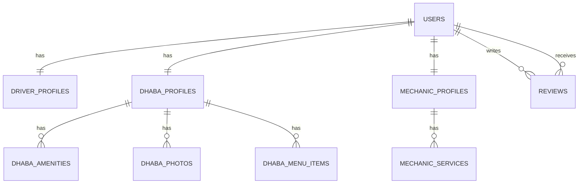

# Highway Setu V1 PostgreSQL Design

## Scope Basis

This schema is generated from the approved V1 scope lock and repository architecture, with strict module limits.

Allowed modules only:

1. Users
2. Driver Profiles
3. Dhaba Profiles
4. Mechanic Profiles
5. Reviews

No tables are created outside these modules.

## Module-to-Feature Mapping

1. Users
   1. OTP Login
   2. User Verification
   3. Vendor Management
2. Driver Profiles
   1. Driver Profile
   2. Truck Details
   3. Start Journey support fields
   4. GPS Tracking support fields
3. Dhaba Profiles
   1. Registration
   2. Profile
   3. Amenities
   4. Photos
   5. Menu
   6. Vendor Discovery
   7. Vendor Details
   8. Distance Calculation
4. Mechanic Profiles
   1. Registration
   2. Services
   3. Availability
   4. Vendor Discovery
   5. Vendor Details
   6. Distance Calculation
5. Reviews
   1. Vendor Details quality metadata

## Extensions

1. pgcrypto for UUID generation

## Tables

### 1) users

Table name: users

Columns:

1. id UUID not null default gen_random_uuid()
2. firebase_uid TEXT not null
3. phone_e164 TEXT not null
4. role TEXT not null
5. verification_status TEXT not null default 'pending'
6. preferred_language TEXT not null default 'english'
7. created_at TIMESTAMPTZ not null default now()
8. updated_at TIMESTAMPTZ not null default now()

Constraints:

1. Primary key on id
2. Unique on firebase_uid
3. Unique on phone_e164
4. Check role in (driver, dhaba_owner, mechanic_owner, admin)
5. Check verification_status in (pending, verified, rejected)
6. Check preferred_language in (english, hindi, punjabi)

Foreign keys:

1. None

Indexes:

1. Unique index on firebase_uid
2. Unique index on phone_e164
3. Btree index on role
4. Btree index on verification_status

### 2) driver_profiles

Table name: driver_profiles

Columns:

1. user_id UUID not null
2. full_name TEXT not null
3. license_number TEXT not null
4. truck_registration_number TEXT not null
5. truck_type TEXT not null
6. gps_tracking_enabled BOOLEAN not null default false
7. current_latitude NUMERIC(9,6)
8. current_longitude NUMERIC(9,6)
9. last_location_at TIMESTAMPTZ
10. created_at TIMESTAMPTZ not null default now()
11. updated_at TIMESTAMPTZ not null default now()

Constraints:

1. Primary key on user_id
2. Check latitude between -90 and 90 when not null
3. Check longitude between -180 and 180 when not null
4. Check that latitude and longitude are either both null or both not null
5. Unique on truck_registration_number

Foreign keys:

1. user_id references users(id) on delete cascade

Indexes:

1. Unique index on truck_registration_number
2. Btree index on gps_tracking_enabled
3. Composite index on current_latitude, current_longitude

### 3) dhaba_profiles

Table name: dhaba_profiles

Columns:

1. user_id UUID not null
2. business_name TEXT not null
3. phone_e164 TEXT not null
4. address_line TEXT not null
5. state TEXT not null
6. district TEXT not null
7. pincode TEXT not null
8. latitude NUMERIC(9,6) not null
9. longitude NUMERIC(9,6) not null
10. is_active BOOLEAN not null default true
11. created_at TIMESTAMPTZ not null default now()
12. updated_at TIMESTAMPTZ not null default now()

Constraints:

1. Primary key on user_id
2. Check latitude between -90 and 90
3. Check longitude between -180 and 180

Foreign keys:

1. user_id references users(id) on delete cascade

Indexes:

1. Btree index on is_active
2. Composite index on latitude, longitude
3. Btree index on district, state

### 4) dhaba_amenities

Table name: dhaba_amenities

Columns:

1. id UUID not null default gen_random_uuid()
2. dhaba_user_id UUID not null
3. amenity_name TEXT not null
4. is_available BOOLEAN not null default true
5. created_at TIMESTAMPTZ not null default now()

Constraints:

1. Primary key on id
2. Unique on dhaba_user_id, amenity_name

Foreign keys:

1. dhaba_user_id references dhaba_profiles(user_id) on delete cascade

Indexes:

1. Unique index on dhaba_user_id, amenity_name
2. Btree index on dhaba_user_id

### 5) dhaba_photos

Table name: dhaba_photos

Columns:

1. id UUID not null default gen_random_uuid()
2. dhaba_user_id UUID not null
3. photo_url TEXT not null
4. display_order INTEGER not null default 1
5. created_at TIMESTAMPTZ not null default now()

Constraints:

1. Primary key on id
2. Unique on dhaba_user_id, photo_url
3. Check display_order greater than 0

Foreign keys:

1. dhaba_user_id references dhaba_profiles(user_id) on delete cascade

Indexes:

1. Unique index on dhaba_user_id, photo_url
2. Btree index on dhaba_user_id, display_order

### 6) dhaba_menu_items

Table name: dhaba_menu_items

Columns:

1. id UUID not null default gen_random_uuid()
2. dhaba_user_id UUID not null
3. item_name TEXT not null
4. price_inr NUMERIC(10,2) not null
5. is_available BOOLEAN not null default true
6. created_at TIMESTAMPTZ not null default now()
7. updated_at TIMESTAMPTZ not null default now()

Constraints:

1. Primary key on id
2. Check price_inr >= 0
3. Unique on dhaba_user_id, item_name

Foreign keys:

1. dhaba_user_id references dhaba_profiles(user_id) on delete cascade

Indexes:

1. Unique index on dhaba_user_id, item_name
2. Btree index on dhaba_user_id, is_available

### 7) mechanic_profiles

Table name: mechanic_profiles

Columns:

1. user_id UUID not null
2. business_name TEXT not null
3. phone_e164 TEXT not null
4. address_line TEXT not null
5. state TEXT not null
6. district TEXT not null
7. pincode TEXT not null
8. latitude NUMERIC(9,6) not null
9. longitude NUMERIC(9,6) not null
10. availability_status TEXT not null default 'available'
11. is_active BOOLEAN not null default true
12. created_at TIMESTAMPTZ not null default now()
13. updated_at TIMESTAMPTZ not null default now()

Constraints:

1. Primary key on user_id
2. Check latitude between -90 and 90
3. Check longitude between -180 and 180
4. Check availability_status in (available, busy, offline)

Foreign keys:

1. user_id references users(id) on delete cascade

Indexes:

1. Btree index on availability_status
2. Btree index on is_active
3. Composite index on latitude, longitude
4. Btree index on district, state

### 8) mechanic_services

Table name: mechanic_services

Columns:

1. id UUID not null default gen_random_uuid()
2. mechanic_user_id UUID not null
3. service_name TEXT not null
4. is_available BOOLEAN not null default true
5. created_at TIMESTAMPTZ not null default now()

Constraints:

1. Primary key on id
2. Unique on mechanic_user_id, service_name

Foreign keys:

1. mechanic_user_id references mechanic_profiles(user_id) on delete cascade

Indexes:

1. Unique index on mechanic_user_id, service_name
2. Btree index on mechanic_user_id, is_available

### 9) reviews

Table name: reviews

Columns:

1. id UUID not null default gen_random_uuid()
2. reviewer_user_id UUID not null
3. vendor_user_id UUID not null
4. vendor_type TEXT not null
5. rating SMALLINT not null
6. review_text TEXT
7. created_at TIMESTAMPTZ not null default now()

Constraints:

1. Primary key on id
2. Check vendor_type in (dhaba, mechanic)
3. Check rating between 1 and 5
4. Check reviewer_user_id <> vendor_user_id
5. Unique on reviewer_user_id, vendor_user_id

Foreign keys:

1. reviewer_user_id references users(id) on delete cascade
2. vendor_user_id references users(id) on delete cascade

Indexes:

1. Unique index on reviewer_user_id, vendor_user_id
2. Btree index on vendor_user_id, created_at desc
3. Btree index on vendor_type

## ER Diagram

## Table Relationships

1. users to driver_profiles is one to one by user_id.
2. users to dhaba_profiles is one to one by user_id.
3. users to mechanic_profiles is one to one by user_id.
4. dhaba_profiles to dhaba_amenities is one to many by dhaba_user_id.
5. dhaba_profiles to dhaba_photos is one to many by dhaba_user_id.
6. dhaba_profiles to dhaba_menu_items is one to many by dhaba_user_id.
7. mechanic_profiles to mechanic_services is one to many by mechanic_user_id.
8. users to reviews through reviewer_user_id is one to many.
9. users to reviews through vendor_user_id is one to many.

## Migration Files

Migration files are provided under infra/database/migrations in ordered, atomic steps.

1. 0001_enable_pgcrypto.sql
2. 0002_create_users.sql
3. 0003_create_driver_profiles.sql
4. 0004_create_dhaba_profiles.sql
5. 0005_create_mechanic_profiles.sql
6. 0006_create_reviews.sql

## Seed Data Strategy

1. Use deterministic seed IDs for local and CI runs.
2. Seed only minimal role-balanced test data:
   1. One admin user
   2. Two drivers
   3. Two dhaba owners with one active dhaba each
   4. Two mechanic owners with one active mechanic profile each
   5. Minimal amenities, menu items, photos, services
   6. Minimal review rows for vendor detail display checks
3. Keep production seed scripts empty except required static dictionaries.
4. Store seed scripts by environment to avoid accidental production inserts.

## Database Audit Report

### Unused Tables

No unused tables detected in this design.

### Unused Columns

No placeholder or unused columns detected. Each column maps to an in-scope feature requirement.

### Duplicate Data Risks

1. phone_e164 exists in users and vendor profile tables to support direct vendor contact display.
2. Mitigation: backend write path must keep profile phone synchronized with users.phone_e164 when the same owner phone is intended.

### Missing Indexes

No critical missing index detected for the defined read paths.

Recommended query-performance checks after launch:

1. Vendor discovery sorting by distance may need PostGIS GiST migration if distance queries become heavy.
2. Review aggregation may need partial indexes if filtering by rating ranges becomes frequent.

### Relationship Issues

1. reviews.vendor_user_id points to users, so vendor role integrity requires DB trigger validation.
2. reviews.reviewer_user_id role policy should ensure only driver role writes reviews.
3. Migrations include triggers to enforce these relationship semantics.
